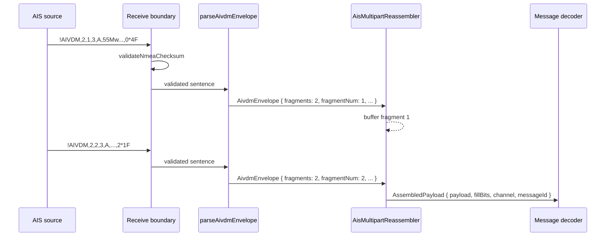

# ADR-0003: AIS multipart reassembly

- Status: Accepted
- Date: 2026-05-06

## Decision

AIS NMEA parsing is split into two layers. An envelope parser validates `!AIVDM`/`!AIVDO` sentence structure and returns a typed `AivdmEnvelope`. A reassembler buffers multi-fragment messages by `(channel, messageId)` key and emits an `AssembledPayload` only when all fragments arrive.

Single-fragment messages bypass the buffer entirely. The buffer is bounded; the oldest entry is evicted when full. Held fragments older than a configurable TTL are pruned. A fragment-count change on an existing key replaces the buffer with a fresh one, treating the new value as the start of a new message.

Checksum validation is the boundary's responsibility (UDP/WebSocket receive site), not the parser's. Both layers operate on already-validated frames.

## Pipeline

## Tradeoffs

- Two layers and a buffer in exchange for clean separation between structure and stateful reassembly
- Bounded buffer + TTL in exchange for memory safety under fragment loss or hostile input
- Slot-indexed buffer (out-of-order tolerant) in exchange for accepting reordered delivery from UDP and racing receiver buffers
- Boundary-only checksum validation in exchange for hot-path throughput

## Evolution

- Type 5 static data decoder (next): consumes `AssembledPayload` from this layer
- Class B / type 18 decoder: same path, single fragment in practice
- Source multiplexing (Hot / Standby across SDR, WebSDR, external feed): handled at a higher layer; the reassembler is per-source-stateless across instances
