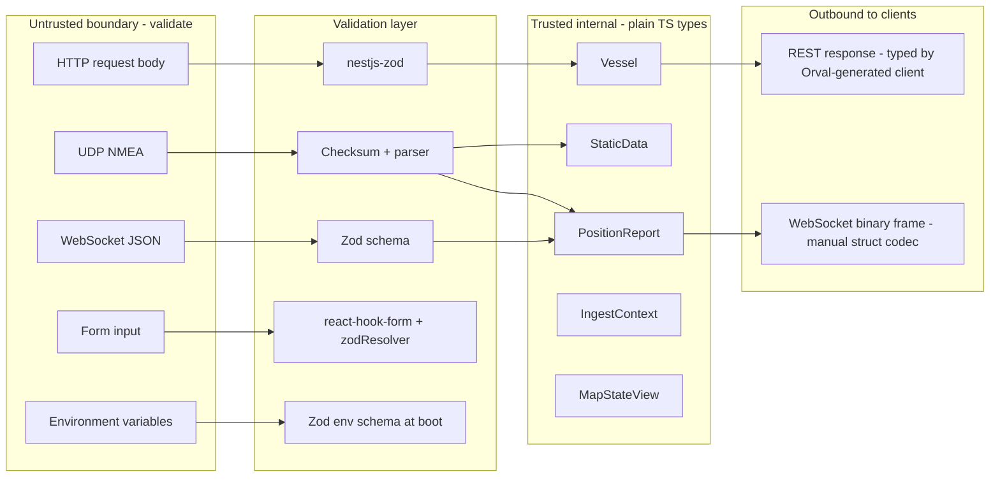

# ADR-0004: Ingest resilience and schema strategy

- Status: Accepted
- Date: 2026-05-06

## Decision

The ingest pipeline applies lightweight resilience now and defers materialized infrastructure to backlog. Schema validation runs strictly at boundaries; internal types stay plain TypeScript.

## Trust zones

## Decisions per layer

### Boundary validation - Zod only

Zod runs at every untrusted entry: NMEA bytes (via checksum + structural parser), AIS Stream JSON (via Zod schema), NestJS request bodies (via `nestjs-zod`), form inputs (via `zodResolver`), environment variables (via Zod parse at boot). Boundary parses untrusted input into typed shape; downstream code never re-validates.

`z.infer<>` types stay local to the boundary file. Internal types are redeclared as plain TypeScript in `packages/shared/types/`. This prevents the trap where a Zod schema becomes an implicit internal source of truth, where validation passing wrong shape produces silent type drift instead of a compile error.

### Internal types - plain TypeScript

`PositionReport`, `StaticData`, `Vessel`, `IngestContext`, `MapStateView` are `type` aliases. No Zod. Trusted because they are produced by code we own and that has already been validated at the boundary.

### Branded types for confusable identifiers

`Mmsi`, `Imo`, and `SourceId` are branded primitives constructed through validating factory functions. MMSI and IMO are both 9-digit integers; without brands, swapping them at a call site compiles silently. Branded types make the swap a compile error.

### Discriminated unions for message families

AIS messages are typed as a union keyed on `messageType`. Exhaustive `switch` raises a TypeScript error when a new variant is added but a case is missing.

### Adapter pattern at every system boundary

Per project convention: NMEA to domain, API to feature, feature to binary. Each adapter exposes `serialize`, `deserialize`, type guards, and validators. Already established for the parser layer.

### Strict TypeScript configuration

Each `tsconfig.json` enables `strict`, `noUncheckedIndexedAccess`, `exactOptionalPropertyTypes`, `noImplicitOverride`. Cheap wins, large coverage.

### Null vs undefined discipline

`null` represents explicit domain absence (sentinel-decoded fields like heading 511 or rate-of-turn -128). `undefined` represents JavaScript uninitialized state. Domain types declare `field: T | null` versus `field?: T` deliberately.

## Resilience strategy

The ingest pipeline ships today with three lightweight mechanisms. Materialized versions are tracked in backlog and adopted only when traffic justifies the maintenance cost.

| Concern                        | Today (lightweight)                                                                    | Materialized (deferred)                                         |
| ------------------------------ | -------------------------------------------------------------------------------------- | --------------------------------------------------------------- |
| Parser errors and bad payloads | try/catch at pipeline boundary, count and log                                          | Bounded DLQ ring buffer with admin endpoint - issue #60         |
| Multi-source duplicates        | None needed - Hot/Standby in IngestSourceMachine guarantees one active source          | Hash-based idempotency window across merged sources - issue #61 |
| Ingest rate exceeds drain rate | Token bucket (200 pkt/s), dgram UDP OS-level drop, WebSocket bufferedAmount monitoring | Priority-based shedding by domain criteria - issue #62          |

## Tradeoffs

- Boundary-only Zod over universal Zod schemas: stronger TypeScript type safety, lower runtime cost, sharper compile errors. Cost: schemas and types declared twice (once Zod boundary, once TS internal). Worth it - the duplication forces deliberate boundary review.
- Branded types: catch a class of identifier-swap bugs at compile time. Cost: factory functions plus type-cast at construction. Worth it for MMSI versus IMO confusion.
- Lightweight resilience now: ships in days, not weeks. Cost: needs replacement when traffic grows. Acceptable - the boundaries (try/catch, token bucket, Hot/Standby) are exactly where the materialized versions slot in.
- Plain TS over Zod-everywhere: avoids the silent-drift class of bug where a runtime validation accepts wrong shape and downstream code consumes typed garbage. Cost: explicit type declarations. Worth it.

## Evolution

- Backlog issue #60: Materialized DLQ buffer for parser failures
- Backlog issue #61: Multi-source ingest with idempotency guard
- Backlog issue #62: Priority-based backpressure shedding
- Backlog issue #63: Set up Orval client codegen at first endpoint (D5)
- ADR-0005 will document the schema-to-client codegen pipeline once Orval lands
