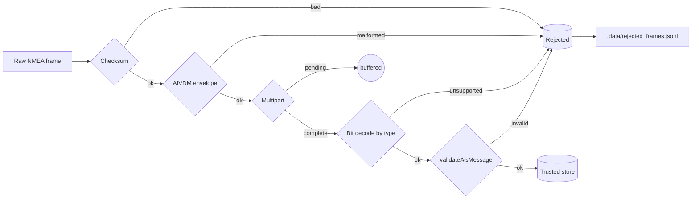

# ADR-0006: Data integrity gate and branded types for AIS ingest

- Status: Accepted
- Date: 2026-05-08

## Context

The ingest pipeline accepts AIS frames from three independent upstream sources (local UDP, regional WebSocket, global feed). The frames arrive as 6-bit packed payloads inside NMEA envelopes; some are well-formed and semantically valid, some are well-formed but carry garbage values, and a small share are malformed at the structural level. Downstream consumers (REST, WebSocket gateway, DB writer, future training corpus) must not be required to defend against any of these failure modes. The pipeline is the single owner of "what is true" about an AIS message.

A cleanly-typed boundary is also a precondition for an AI/ML downstream: a training corpus contaminated with sentinel-disguised null values, out-of-range coordinates, or impossible MMSIs poisons every model that learns from it.

## Decision

Three coordinated mechanisms, materialised in this commit:

1. **Branded types** for the two domain primitives that share shape with countless other numbers in the codebase: `Mmsi` and `Imo`. The brand is a phantom symbol erased at runtime; the only legal way to construct a branded value is through a smart constructor (`parseMmsi`, `parseImo`) that enforces the corresponding invariant.
2. **A boundary validator** (`validateAisMessage`) that takes a parsed `AisMessage` and returns a typed `Result<AisMessage, RejectReason>`. The function is the single decision point: every frame that reaches storage has passed it.
3. **A dead-letter writer** that appends one JSONL row per rejected frame to `.data/rejected_frames.jsonl`. The audit trail is local-only (gitignored), structured for downstream analysis, and future-proof for feeding a model that learns to predict transmission corruption.

`SourceId` is migrated from a string-literal union to a numeric `as const` identifier (`LocalUdp = 0`, `WebSdr = 1`, `AisStream = 2`). Numeric ids fit a single byte in binary WebSocket frames, sort by priority naturally, and provide stable column values for any future feature store.

## Pipeline

Each rejection variant is a discriminated union member. The DLQ row carries the variant verbatim, so an analyst tracing a transmission corruption sees exactly which invariant fired.

## Tradeoffs

- Brand factories cost zero runtime (the brand is a phantom symbol). The expense is a single allocation of a `Result` object per validation. Negligible relative to the parser cost.
- The DLQ writes synchronously to disk. Poison frames are rare; the deterministic flush makes the file usable for live tailing and analysis without a queue layer. If write rates ever justify it, the writer interface is replaceable.
- The MMSI baseline accepts the standard 9-digit ship range (MID 200..799) only. AtoN, SAR aircraft, base station and craft-associated MMSI ranges are intentionally rejected at this baseline; the rejection produces a typed reason in the DLQ. The decision to widen the predicate is gated on real `.data/rejected_frames.jsonl` traffic rather than upfront speculation.
- Branded types are not yet applied to parser output types (`PositionReport`, `StaticData`, `ClassBPositionReport` keep `mmsi: number`). The brand surface is exposed only via the smart-constructor return type. Tightening parser outputs is a localised follow-up at the D5 DB-writer boundary; the pattern is already there for the migration.

## Alternatives considered

- A single Zod schema covering structural and semantic invariants. Rejected because the structural layer already exists as a hand-rolled bit decoder; bolting Zod on top adds a runtime dependency without removing the bit-level work, and Zod's per-field error reporting is less precise than a discriminated `RejectReason` union.
- Throwing on every invariant violation. Rejected because the pipeline must distinguish `pending` (multipart not yet complete) from `rejected` (poison) without exception bookkeeping; a typed `Result` keeps the call site declarative.
- An in-memory ring DLQ. Rejected for the audit-trail use case: a JSONL file survives process restart, is greppable, and feeds downstream tooling (corpus prep, anomaly analysis) without a custom reader.

## Evolution

- Tighten parser output types (`mmsi: Mmsi`, `imo: Imo | null`) when the D5 DB writer lands; the smart constructors are the call site.
- Widen the MMSI predicate after `.data/rejected_frames.jsonl` has accumulated representative traffic; the decision will be data-driven, not speculative.
- Cross-source duplicate dedup (idempotency window, ADR-0004 backlog) layers on top of the gate without changing the gate signature.
- A future Orval-generated REST client can be wrapped at codegen time so that response fields named `mmsi`/`imo` carry the brands by default; the wrapper lives outside the generated file so regenerations stay clean.
