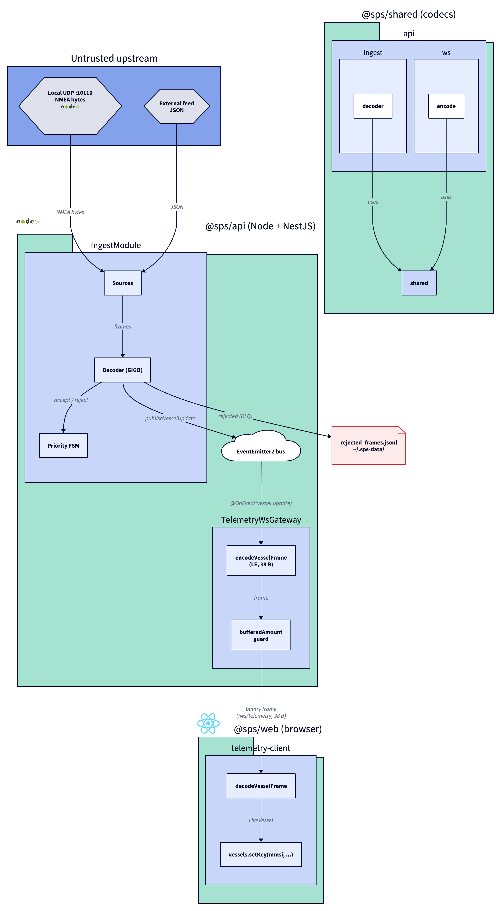

# ADR-0007: D5 binary WebSocket protocol and ingest co-location

- Status: Accepted
- Date: 2026-05-08

## Context

D5 brings vessels into the browser. The path from a UDP byte to a marker on a map needs to go through three concerns: ingest (parsers, GIGO gate, FSM), transport (gateway broadcast to N clients with backpressure), and FE consumption (decode + atomic store update). Each can be split into its own deployable unit or co-located. The choice has direct effects on operational complexity, debug ergonomics and the wire format we commit to.

For wire format, JSON over WebSocket would have shipped in a day but trades 4x bandwidth and forces the FE to live with stringly-typed numbers. Binary-typed structs are slightly more code now and a strong invariant later: every field has a fixed byte position, every byte has a fixed meaning, and the encoder + decoder share one source.

## Decision

Three coordinated mechanisms:

1. **Ingest co-located in `apps/api` as `IngestModule`.** The standalone worker is retired. Sources, the GIGO decoder, the DLQ writer and the priority FSM all live behind a single Injectable service inside the NestJS container. Validated `AisMessage` events are published on the in-process `EventEmitter2` bus as `vessel.update`.
2. **Push-only binary WebSocket gateway at `/ws/telemetry`.** Subscribes to `vessel.update`, encodes a 38-byte `VesselUpdateFrame` via the shared codec, broadcasts to every open client. Clients whose `bufferedAmount` exceeds 1 MB are skipped for the round; persistent slowness will be escalated to disconnect in a follow-up. Binary-only protocol: a text frame from a client closes the connection with status 1003.
3. **FE consumer in `apps/web/src/modules/telemetry/`.** A WebSocket client decodes incoming binary frames via the shared codec and writes into `$vessels` (Nano Stores `map()`, atomic per-MMSI). Reconnects with exponential backoff capped at 30 s. The decoder is the single boundary; the rest of the FE reads `LiveVessel` records, never raw frames.

## Pipeline

> Source: [`0007-pipeline.d2`](./0007-pipeline.d2). SVG export: [`0007-pipeline.svg`](./0007-pipeline.svg). Re-render with `d2 adr/0007-pipeline.d2 adr/0007-pipeline.png --theme=8 --pad=20`.

## Tradeoffs

- Co-locating ingest and API in one process eliminates an IPC boundary at the cost of conflating two failure modes (a runaway ingest worker now takes the API down with it). Acceptable for a single-host deployment; a deferred follow-up can re-extract ingest behind a queue if traffic justifies the split.
- Binary WebSocket frames trade ~5x development effort versus JSON for ~75% bandwidth reduction, type-level discipline at both ends and forward-compatibility with a binary wire layer (potentially shared with mobile / native clients).
- The 38-byte schema is rigid by design. Extending it (e.g. a sequence counter) requires a protocol-version byte at offset 0 and a coordinated FE update; the trade is that today every byte has a fixed meaning and the codec is testable in isolation.
- Backpressure by client skip rather than queue means a slow client misses updates without halting the broadcast for everyone else. The FE can detect missed updates from a future sequence counter and request a snapshot if needed.
- `EventEmitter2` synchronous dispatch means the gateway's `OnEvent` handler runs inline on the ingest hot path. Acceptable because the handler is encode + send, both O(1) with bounded constants. If a future subscriber needs heavier work, switch that subscriber to `@OnEvent({ async: true })` or bounce through a queue.

## Alternatives considered

- **REST polling for vessel positions.** Rejected: 200 vessels at 1 Hz would put 200 req/s of polling load on the API and a multi-second display lag.
- **JSON over WebSocket.** Rejected on bandwidth and on type-discipline grounds; the FE would re-validate every payload.
- **Separate ingest worker pushing to API over HTTP.** Rejected because the IPC boundary adds debug surface area without a corresponding fault-isolation benefit at the SPS scale.
- **socket.io transport.** Rejected: the protocol stack is heavier than what we need for push-only binary, and `@nestjs/platform-ws` (raw `ws`) gives us direct control over `bufferedAmount` without an abstraction.

## Evolution

- Add a sequence-counter byte to the schema once the FE consumes it (drop detection in ConnectionMachine, missed-frame counter in `/__perf`). The wire change is one extra `u32` and a coordinated FE bump.
- Split the broadcast into two channels: position updates on `/ws/telemetry`, static-data updates (type 5) on `/ws/static`. Today both go through the same gateway; the FE filters by `messageType`.
- Server-side filter by client-declared bounding box. Today every client receives every vessel; for >1 k vessels the FE filtering will saturate the WS link.
- Re-extract `IngestModule` into its own process once cross-instance dedup or multi-region ingest is on the roadmap (per ADR-0004 backlog #61).
