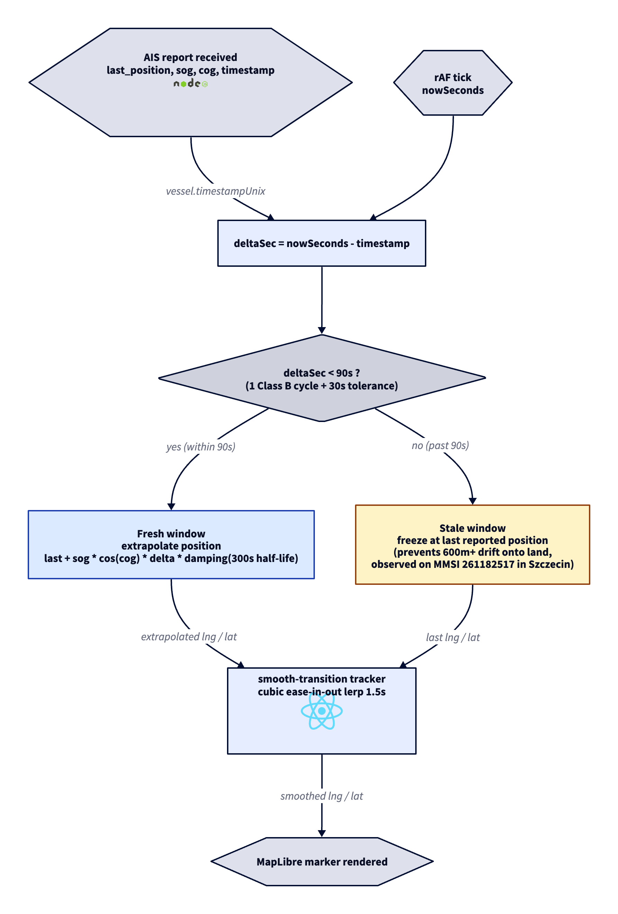

# ADR-0011: Dead reckoning extrapolation freezes after 90s of staleness

- Status: Accepted
- Date: 2026-05-10

## Context

`apps/web/src/modules/map/lib/dead-reckoning.ts` extrapolates a vessel's displayed position from its last reported AIS frame using `last_position + sog * cos(course) * delta * damping(half_life=300s)`. The original `MAX_REASONABLE_DELTA_SEC = 600` cap allowed extrapolation up to 10 minutes past the last report. Damping reduces the projected motion but does not bound it: at SOG 7.7 kn and delta 300s, damping is 0.5 and the projected drift is ~594 metres along the reported course.

This produced a real visual defect in Szczecin port: a Class B vessel (AIS type 18, MMSI 261182517) with last update 5 minutes prior and reported course 5.7° (almost due north) was rendered ~600m inland in Park Zeromskiego while live-camera footage showed it moored at the riverside. The marker visually contradicts the underlying AIS truth.

## Decision

Lower `MAX_REASONABLE_DELTA_SEC` from 600 to 90. Beyond 90 seconds without a fresh AIS report, the marker freezes at the exact last reported position. Within the 90s window the existing damped extrapolation runs unchanged, so fresh vessels still animate smoothly; the existing cubic-ease tracker handles the transition from extrapolated to last-known position when the threshold is crossed.

90s is one Class B reporting cycle (~30s underway) plus 30s tolerance for sub-sampling on the AisStream free tier. Class A reports every 2-10s underway, so for Class A any miss of 90s is a genuine signal loss, not normal cadence.

## Pipeline

> Source: [`adr/0011-state.d2`](./0011-state.d2). SVG export: [`adr/0011-state.svg`](./0011-state.svg). Re-render with `d2 adr/0011-state.d2 adr/0011-state.png --theme=8 --pad=20`.

## Tradeoffs

- A vessel that genuinely has been moving the whole time but whose AIS reports were sub-sampled by AisStream will display as "frozen" at the last received position, not at its true current position. This is preferred over the alternative ("display at extrapolated position that may be on land"): we trust observed truth over confident extrapolation. MarineTraffic and VesselFinder display stale vessels the same way.
- The transition at the 90s boundary is not instantaneous from the user perspective: the cubic-ease tracker in `dead-reckoning-tracker.ts` interpolates the displayed marker from the previous extrapolated position to the new (last-fix) position over 1.5 seconds. So the marker visibly slides back to the last fix rather than snapping. Existing infrastructure, no new code needed.
- The 90s threshold ignores message type. A Class A vessel that genuinely stops reporting for 60s has a real problem (transponder off, signal lost) and showing extrapolation for it is questionable too. Picking a single threshold over per-class differential keeps the rule simple and the code one constant.
- The `velocityDampingFactor` half-life of 300s is now somewhat overspecified for the 90s window: at 90s damping is ~0.81, at 60s ~0.87. Damping still does useful work suppressing aliasing artifacts in the smooth-tracker, but the half-life could be retuned to give more visual motion at fresh deltas in a future polish PR. Out of scope here.

## Alternatives considered

- **Hard distance cap (e.g. 200m max extrapolation, no time threshold).** Rejected: a vessel last reported on the river bank would still render up to 200m from the last fix, possibly on land or on an adjacent berth. The cap value is essentially arbitrary (200m? 100m? 300m?) and tied to local geography rather than AIS protocol semantics. Freezing at the last reported position is a clean semantic ("we trust the last truth, period") that defends itself in a code review without river-width arguments.
- **Per-class differential thresholds (Class A 30s, Class B 90s).** Rejected for MVP: adds a code branch on `messageType` for a marginal accuracy win, while the simple rule covers the observed bug and a correct 95% of the cases. Revisit if a Class A specific issue is observed.
- **Fade marker opacity by age toward 0% at 90s, then hide.** Rejected: hides the vessel entirely from the map, removing the operator's ability to see where it last was. The current visual treatment (full opacity at last position) is more useful for operations.
- **Display a "stale" badge or dotted ring around the marker beyond 90s.** Deferred to D7-PR5 (positionAccuracy + uncertainty UI). Worth doing but orthogonal to this hot-fix.

## Evolution

- D7-PR5 will add the visual stale indicator (opacity fade or dotted ring) so the operator sees explicitly that a vessel is past the freshness window.
- Future ML-driven approach: train a model on observed AIS gaps + vessel class + sog to predict whether a vessel is actually moving during a sub-sampling gap or genuinely stopped. Out of scope for the SPS portfolio sprint.
