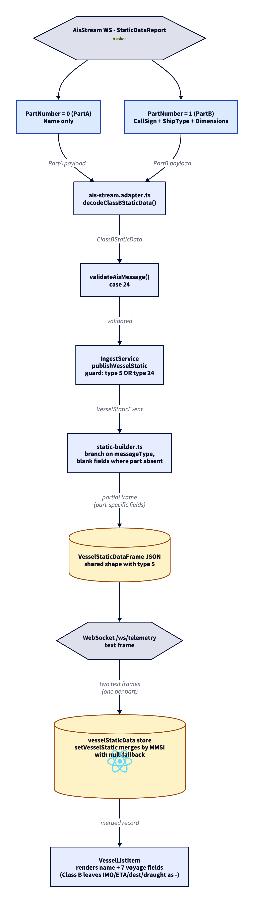

# ADR-0012: Class B static data (AIS type 24) wire-frame reuse + FE merge

- Status: Accepted
- Date: 2026-05-10

## Context

Class B AIS units (yachts, fishing boats, recreational craft <300 GT) broadcast AIS type 24 = a simplified static data report. The message is split across two parts under ITU-R M.1371-5 §3.3.8.4.4:

- PartA (PartNumber=0): vesselName only
- PartB (PartNumber=1): callSign, shipType, dimensions, vendorId, mothershipMmsi

Class B does not broadcast type 5 - it has no IMO number, no destination, no draught and no ETA. Each part is independently broadcast and either can arrive first. AisStream's WebSocket feed surfaces them as `StaticDataReport` payloads with `PartNumber` field.

Pre-PR state: `apps/api/src/ingest/adapters/ais-stream.adapter.ts` had no branch for `StaticDataReport`, so every Class B static payload landed in the DLQ as `unsupported-payload`. The `AisMessage` union did not include type 24. The sidebar showed every Class B vessel as a 9-digit MMSI forever, even when the vessel was actively broadcasting its name.

## Decision

Three coordinated mechanisms:

1. **Wire-frame reuse.** Both AIS type 5 (Class A static) and AIS type 24 (Class B static) emit the same `VesselStaticDataFrame` JSON shape (defined in ADR-0010). Class B leaves `imo`, `draught`, `destination`, `eta` as null/empty - the existing FE renderer already shows "—" for null fields without code changes. No new discriminator, no new FE store, no new hook.
2. **FE merge with null-fallback.** Each AIS type-24 part is published immediately as a partial `VesselStaticDataFrame` with the absent-side fields blank. The FE store `setVesselStatic` merges with the previous record by MMSI: non-empty incoming fields overwrite, blank fields preserve previous values. Mirrors the merge pattern in `vessels.store#setVessel` for position updates with null fields. No server-side reassembler, no per-MMSI buffer, no part-completion timeout.
3. **Type union extension.** `ClassBStaticData` is added to the `AisMessage` union in `@sps/shared`, with a `partNumber: 0 | 1` field plus the Class B fields. The validator's `case 24` checks `partNumber` is in {0, 1}. The IngestService publish guard widens from `messageType === 5` to `messageType === 5 || messageType === 24`. Static-builder branches on the type at the wire-frame conversion site.

## Pipeline

> Source: [`adr/0012-class-b-static-flow.d2`](./0012-class-b-static-flow.d2). SVG export: [`adr/0012-class-b-static-flow.svg`](./0012-class-b-static-flow.svg). Re-render with `d2 adr/0012-class-b-static-flow.d2 adr/0012-class-b-static-flow.png --theme=8 --pad=20`.

## Tradeoffs

- Both parts cross the wire as separate text frames. For a single Class B vessel, this is two messages instead of one merged message (which a server-side reassembler would produce). The bandwidth cost is negligible: each part is ~150 bytes JSON, total ~300 bytes per vessel per voyage segment. Class A type 5 stays at one frame per voyage segment.
- The FE store's merge function grows from a one-line `setKey` to ~25 lines of field-by-field null-fallback. Same complexity profile as the existing `setVessel` merge for position - readers familiar with one understand the other.
- Until both parts arrive, the sidebar shows a partial record (vessel with name but no callSign, or vice versa). The "—" placeholders for null fields make this clear to the operator. An alternative (hide the row entirely until both parts arrive) would lose information for vessels broadcasting only PartA - which happens for some recreational units that never transmit PartB.
- Wire-format reuse means the FE cannot trivially distinguish "type 5 with null fields" from "type 24 with blank fields" by inspecting the frame. The shape is unified; the source is hidden. This is intentional - the FE renders the same UI for both, and surfacing the source kind in the wire frame would only serve as a debug hook.
- The `messageType` literal `24` propagates through the validator's exhaustive switch, the static-builder's branch, the ingest publish guard's check. Every consumer must extend its switch when type 24 lands. The TS exhaustiveness check (`never` default) flags any forgotten consumer at compile time, which is what caught the `frame-builder.ts` switch when this PR landed. Acceptable cost - the branches are small, the compile-time discipline pays for itself.

## Alternatives considered

- **Server-side reassembler in IngestService.** Buffer per-MMSI: hold PartA until PartB arrives (or vice versa) plus a 5-minute timeout, emit one merged event. Rejected: adds stateful infrastructure (per-MMSI map, eviction logic, timeout policy) for a concern the FE store already handles for free via its merge pattern. Server-side state means restart of the ingest service loses pending parts; FE-side state is browser-local and survives the same reload model as everything else in `$vesselStaticData`.
- **Separate `kind` discriminator on the wire (`vessel.static.classB`).** New event, new store, new hook, new sidebar branch. Rejected: doubles the FE state shape for a difference that does not change rendering (Class B "—" for IMO is identical UX to Class A type 5 with null IMO). The Class A vs Class B distinction is interesting only for filtering / analytics, both deferred concerns.
- **Drop Class B static entirely; show MMSI for type 24 vessels.** Rejected: violates the demo narrative (recruiter sees a recognizable port full of named vessels, not 9-digit numbers).
- **Combine type 5 and type 24 wire frames into a discriminated union with a `class: "A" | "B"` tag.** Rejected: introduces a wire-level concept (vessel class) that the FE does not act on. Pure complexity tax with zero rendering payoff.

## Evolution

- D7-PR5 (queued immediately after this one): NMEA decoder for type 24 in `packages/shared/src/parsers/ais-class-b-static.ts`, plus `decoder.ts case 24`. Lets the local SDR receiver pick up Class B static when the antenna is wired up. The wire frame and FE merge stay unchanged - only the bit-level decode is added.
- D7-PR-X (tentatively): visual stale indicator for vessels past the freshness window (positionAccuracy flag + uncertainty UI). Class B markers benefit more than Class A because Class B GPS modules are typically lower accuracy.
- AtoN type 21 + base station type 4: reuse the discriminator namespace with new `kind: "aton.update"` etc. Wire pattern carries over.
