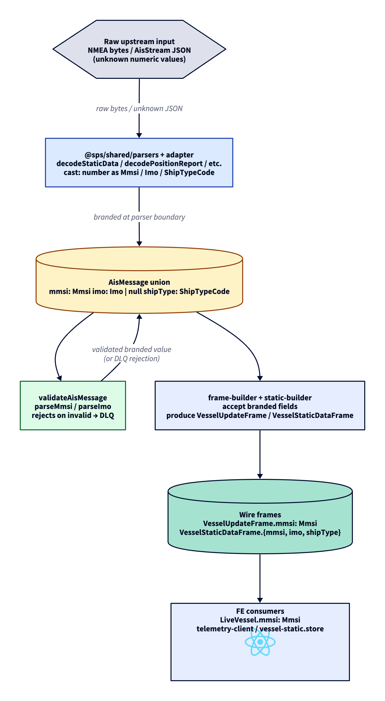

# ADR-0013: Branded numeric AIS types (Mmsi, Imo, ShipTypeCode)

- Status: Accepted
- Date: 2026-05-10

## Context

`packages/shared/src/types/brands.ts` declared `Mmsi` and `Imo` as branded `number` aliases at D5, with smart constructors `parseMmsi` / `parseImo` in `validators/`. The brands existed as a forward-looking discipline marker but were never propagated through the `AisMessage` union: every variant kept `mmsi: number`, `imo: number | null`, and consumers passed any number where an MMSI was expected. The brand carried no compile-time discipline.

`shipType` had no brand at all. The wire field is 8 bits (range 0..255) and the spec assigns meaning to 0..99; the rest is upstream-reserved. Consumers accepted any number here too, which is not unsafe at runtime (the codec round-trips bytes correctly) but is a missed opportunity at the type layer.

The cost of inconsistent branding showed up at every cross-module boundary: a parser returning `mmsi: number`, a builder accepting it, a validator branding internally but throwing the brand away at return time, an FE store typing it back as `number`. Reviewers had no static signal of whether a value had passed validation; tests could pass an unvalidated literal as if it were validated.

## Decision

Three coordinated changes:

1. **Add `ShipTypeCode` brand.** Range 0..255 (full 8-bit field). `parseShipType(value): Result<ShipTypeCode>` is the single legal cast site. The brand is conceptually weaker than `Mmsi` (the spec only assigns meaning to 0..99 but accepting the full byte range round-trips upstream noise without losing data); `shipTypeCategory` maps unknown bands to `other`.
2. **Propagate `Mmsi` / `Imo` / `ShipTypeCode` through every AisMessage variant.** `PositionReport.mmsi: Mmsi`, `StaticData.{mmsi: Mmsi, imo: Imo | null, shipType: ShipTypeCode}`, `ClassBPositionReport.mmsi: Mmsi`, `ClassBStaticData.{mmsi: Mmsi, shipType: ShipTypeCode, mothershipMmsi: Mmsi | null}`, plus the wire frames `VesselUpdateFrame.mmsi: Mmsi` and `VesselStaticDataFrame.{mmsi: Mmsi, imo: Imo | null, shipType: ShipTypeCode}`, plus `LiveVessel.mmsi: Mmsi` on the FE.
3. **Pragmatic cast at the parser boundary.** Parsers (NMEA bit decoders + AisStream JSON adapter) are the GIGO inflow: they cast raw decoded numbers to brand types directly (`mmsi as Mmsi`). Validators (`validateAisMessage`) remain the gatekeepers - they call `parseMmsi` / `parseImo` and reject the message if invalid. The brand at runtime is structural (just a `number`); at compile time it carries the marker "this came from a parser or validator, not a literal".

## Pipeline

> Source: [`adr/0013-branded-types-flow.d2`](./0013-branded-types-flow.d2). SVG export: [`adr/0013-branded-types-flow.svg`](./0013-branded-types-flow.svg). Re-render with `d2 adr/0013-branded-types-flow.d2 adr/0013-branded-types-flow.png --theme=8 --pad=20`.

## Tradeoffs

- The brand is a phantom type erased at runtime. A determined consumer can `value as Mmsi` to cast around it; the discipline is "by convention, only validators and parsers cast". A future refactor could flip parsers to use the smart constructors and throw on invalid (then the brand would actually prove validity), but that changes parser error contracts and was not in scope here.
- Test fixtures now require `as Mmsi` / `as Imo` / `as ShipTypeCode` casts at every literal site. ~25 fixture sites updated across shared / api / web. A future helper (`mmsi(261_345_678)` / `imo(...)` / `shipType(...)`) could compress this; for now the casts are explicit and document intent.
- The `mothershipMmsi: Mmsi | null` field on `ClassBStaticData` is rarely populated in practice (Class B craft tied to a mothership is uncommon outside fishing fleets). Branding it costs nothing extra and stops any consumer that does use it from passing a regular MMSI.

## Alternatives considered

- **Zod schemas as the source of truth for AIS types.** Reject runtime-failed messages at every boundary, infer types from schemas. Rejected per L8 (Zod schema becomes implicit source of truth, plain TypeScript types are the explicit one) and ADR-0004 §B1. Brand-with-validator is ~30 LOC per type; the equivalent Zod treatment would add runtime cost on the hot path and inferred types that are harder to read at function signatures.
- **Runtime-only validation (no brands).** Keep `mmsi: number` everywhere, validate at the GIGO boundary, trust internal flow. Rejected: the AisMessage type carried zero documentation of which fields had passed validation; reviewers had to trace the call chain to know whether a number was checked. The brand is a 5-character footprint per field and reads as "this passed validation".
- **Drop the brand entirely; rename to `MmsiCandidate` / `ValidatedMmsi`.** Two-tier types (raw + validated) similar to how Result types model errors. Rejected as overkill for SPS scale - the brand already carries the "validated" semantic at compile time without splitting the type space.
- **Validate inside parsers, throw on invalid.** Parsers would call `parseMmsi` / `parseImo` and throw if the smart constructor returns `err`. The brand would then prove validity at runtime. Rejected for now: parsers already throw on bit-level errors (`PositionReportTooShortError`, etc.), adding `InvalidMmsiError` and `InvalidImoError` widens the parser error contract and forces every consumer that catches these to handle two new error kinds. The validator stays the single point that distinguishes "structurally parsed" from "passes invariants".

## Evolution

- A future `mmsi()` / `imo()` / `shipType()` factory in shared/test-utils could compress fixture casts to `mmsi(261_345_678)`, returning a branded value via a dev-only assertion. Reduces test noise and gives a uniform construction path.
- If a real defect appears where a literal MMSI bypasses validation in production code, flip parsers to throw via the smart constructors. The brand would then be load-bearing at runtime, not just at compile time.
