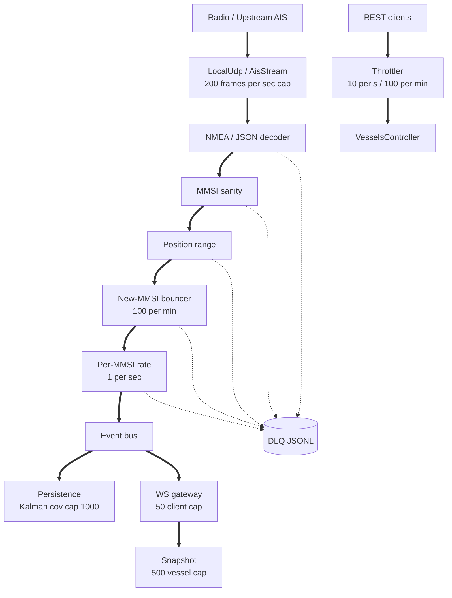

# ADR 0015 - Security hardening architecture

- Status: accepted
- Date: 2026-05-12

## Context

The api ingests AIS broadcasts from untrusted radio plus an upstream feed, fans messages out to public WebSocket clients, and serves a public REST surface. Three entry points, none authenticated. A pre-merge security audit surfaced multiple DoS and data-poison vulnerabilities.

## Decision

Layered defence: each surface gets explicit bounds at the layer best positioned to enforce them, and every rejection writes a typed reason to the dead-letter queue for forensic review.

## Flow

## Layers

| Layer                 | Where             | Bound                             |
| --------------------- | ----------------- | --------------------------------- |
| MMSI sanity check     | ingest validators | ITU-R M.585 range + MID prefix    |
| Position range check  | ingest validators | lat/lng/SOG/COG/heading           |
| New-MMSI bouncer      | ingest limiters   | 100 introductions per minute      |
| Per-MMSI rate limit   | ingest limiters   | 1 frame per second per MMSI       |
| Snapshot vessel cap   | telemetry-ws      | 500 entries, lastSeenAt desc      |
| Concurrent client cap | telemetry-ws      | 50 simultaneous WebSocket clients |
| Kalman covariance cap | persistence       | 1000 absolute, reset on overflow  |
| HTTP throttler        | REST surface      | 10 per second, 100 per minute     |

Each layer is independent. A bypass of one (for example: an attacker uses a real Polish MMSI to clear the sanity check) still hits the next.

## Consequences

- Memory footprint is bounded under any traffic profile because every unbounded structure (snapshot, client set, Kalman covariance, REST request rate) now has an explicit ceiling.
- The dead-letter queue keeps a typed forensic trail of every dropped frame, so abuse patterns are inspectable after the fact.
- Throughput drops compared to the unbounded baseline; constants live at the top of each guard file and can be tuned without changing structure.

## Out of scope

- Per-IP rate limit on the WebSocket gateway. Deferred until real traffic shows the global cap is insufficient.
- A Redis-backed throttler store. The in-memory implementation is correct for the current single-machine deployment.
- An AIS NMEA encoder for full end-to-end validation of the four ingest guards. Filed as a backlog item.
