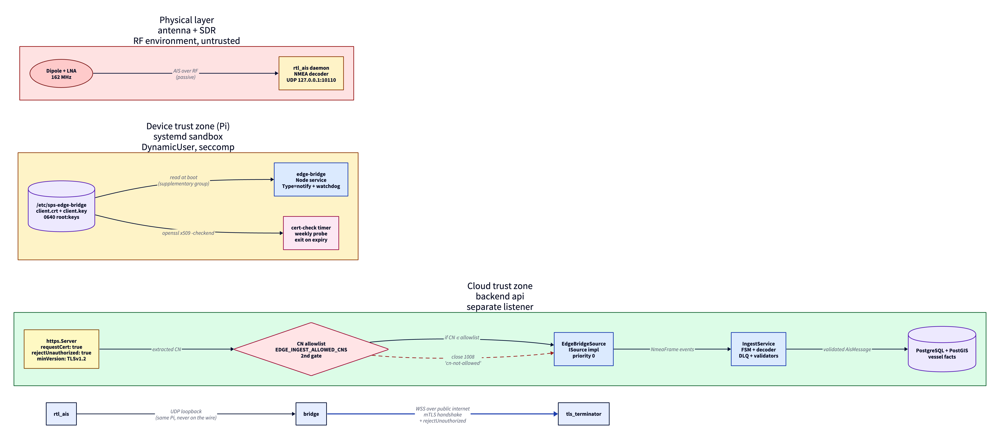

# ADR 0019 - Edge bridge trust zones, sandbox hardening, and cert lifecycle

**Status:** Accepted
**Date:** 2026-05-24
**Supersedes:** none
**Related:** ADR-0011 (SDR hardware), ADR-0012 (Fly deploy + PostGIS)

## Context

The Pi-to-cloud forwarder spans three physical environments with very different trust assumptions: an RF antenna feeding `rtl_ais` on a Raspberry Pi, the Pi itself, and the cloud-side ingest gateway in `apps/api`. Frames have to travel from antenna to PostgreSQL, but no two of those environments should trust each other implicitly.

Earlier chunks landed the transport (UDP listener + WSS client with backoff and graceful shutdown) and the backend listener with mutual TLS plus a Common-Name allowlist. This ADR records the decisions that make the **device side** match the strength of the **wire side**: a hardened systemd sandbox, an in-process watchdog, and a weekly cert-expiry probe.

## Trust zones

[D2 source](0019-edge-bridge-trust-zones.d2)

Three concentric trust zones, each defended at the boundary by a different mechanism:

1. **Physical (untrusted).** The antenna and `rtl_ais` decoder. Anyone with an AIS transponder in range can inject sentences here. Frames are treated as untrusted input by everything downstream.
2. **Device (sandboxed).** The Raspberry Pi runs the bridge under a systemd unit whose sandbox profile drops every capability, restricts every syscall family the process does not need, runs as a `DynamicUser` with no persistent home, and caps memory and FD counts so a runaway cannot starve `rtl_ais`. The cert material lives in `/etc/sps-edge-bridge/`, owned by root, group-readable through a dedicated supplementary group only.
3. **Cloud (mTLS-gated).** The backend exposes the edge listener on a dedicated port that is mTLS-only. The TLS layer verifies the cert chain; the application layer extracts the Common Name and matches it against an env allowlist. Both gates must pass.

## Decisions

### D-19-1: Pi-side process runs under a hardened systemd unit

`apps/edge-bridge/systemd/sps-edge-bridge.service` enables every isolation directive that does not break the bridge's actual job:

- `DynamicUser=yes` provisions a per-boot UID with no persistent identity. `StateDirectory`, `LogsDirectory` and `CacheDirectory` are auto-created with correct ownership.
- Filesystem: `ProtectSystem=strict`, `ProtectHome=yes`, `PrivateTmp=yes`, `PrivateDevices=yes`, `ReadOnlyPaths=/opt/sps-edge-bridge`.
- Kernel surface: `ProtectKernelTunables`, `ProtectKernelModules`, `ProtectKernelLogs`, `ProtectControlGroups`, `ProtectProc=invisible`, `ProcSubset=pid`, `ProtectClock`, `ProtectHostname`.
- Namespaces: `PrivateUsers=yes`, `PrivateMounts=yes`, `RestrictNamespaces=yes`.
- Privileges: `NoNewPrivileges=yes`, empty `CapabilityBoundingSet` and `AmbientCapabilities`, `LockPersonality`, `RestrictRealtime`, `RestrictSUIDSGID`.
- Memory: `MemoryDenyWriteExecute=yes`, `MemoryMax=256M`, `MemoryHigh=192M`.
- Network: `RestrictAddressFamilies=AF_UNIX AF_INET AF_INET6` only; raw, netlink, bluetooth and the rest are denied.
- Syscalls: `SystemCallFilter=@system-service ~ @privileged @resources @obsolete @cpu-emulation`, `SystemCallArchitectures=native`.
- Restart loop with `StartLimitBurst=3` per `StartLimitIntervalSec=60s` so a tight failure loop trips into `failed` instead of consuming CPU.

The expected outcome is `systemd-analyze security sps-edge-bridge.service` returning an exposure level below 3.0.

### D-19-2: Watchdog with `Type=notify`

Node's event loop can be wedged by a sync exec, a long native call, or a deadlock - none of which exit the process. Without a watchdog, systemd would see a healthy process while the bridge silently drops frames.

`apps/edge-bridge/src/watchdog.ts` implements the `sd_notify` protocol by shelling out to the `systemd-notify` binary that ships with every modern Linux. The process emits `READY=1` only after the UDP listener binds and the WSS client opens its first connection, then `WATCHDOG=1` at half the configured `WatchdogSec`. A wedged loop misses one ping and systemd SIGKILLs + restarts within 30 seconds.

The protocol is opt-in: when `$NOTIFY_SOCKET` is absent (local dev, plain container without `--notify`) every method becomes a no-op, so the same source runs identically outside systemd.

### D-19-3: Weekly cert-expiry probe

`apps/edge-bridge/systemd/sps-edge-bridge-cert-check.service` runs `scripts/check-edge-cert-expiry.sh` on a `.timer` once per week (plus on every boot via `OnBootSec=10min` and `Persistent=yes` so a Pi that was offline catches up). The probe reads the client cert, runs `openssl x509 -checkend`, and exits with a severity-mapped code: 0 healthy, 1 within 30 days, 2 within 7 days or already expired, 3 unreadable.

The unit itself is sandboxed identically to the main service, including `PrivateNetwork=yes` since the probe touches files only.

### D-19-4: Cert rotation stays manual, allowlist remains env-based

Automatic renewal (cert-manager, ACME-style) is deferred. Today the operator regenerates the client cert from the workstation and `scp`s it to the Pi; the new cert is the same CN, signed by the same CA, so no allowlist change is needed. Allowlist changes for adding or removing devices remain an api restart - acceptable for the current device count, refactor to a DB-backed registry once devices exceed three.

## Threat model

What the layered defense buys, expressed against concrete adversaries:

| Adversary                                             | Capability                                                      | Blocked by                                                                                                                             |
| ----------------------------------------------------- | --------------------------------------------------------------- | -------------------------------------------------------------------------------------------------------------------------------------- |
| Passive radio listener                                | Captures AIS RF, replays NMEA at the antenna                    | Frame contents are public AIS broadcast; replay is the same as the original transmission. Not a defended attack surface.               |
| Network attacker on path                              | Intercepts WSS traffic between Pi and backend                   | TLS confidentiality + integrity. mTLS prevents the attacker from acting as either endpoint.                                            |
| Attacker with a CA-signed cert from a different fleet | Connects to the backend with a valid X.509 chain                | CN allowlist drops the handshake at `1008 cn-not-allowed`; the cert never gets to send a frame.                                        |
| Attacker who steals a Pi's `client.key`               | Connects as that Pi, replays valid traffic                      | Removed from `EDGE_INGEST_ALLOWED_CNS`, restart api. Future device registry will revoke by row.                                        |
| Local user on the Pi                                  | Reads `/etc/sps-edge-bridge/client.key`                         | 0640 root-owned, supplementary-group access only; bridge `DynamicUser` is the sole non-root reader.                                    |
| Compromised bridge process                            | Tries to escalate, mount, load kernel modules, open raw sockets | Sandbox: no capabilities, seccomp denies privileged syscalls, namespaces isolate kernel surface, `RestrictAddressFamilies` blocks raw. |
| Operator who forgets to rotate certs                  | Cert expires, bridge cannot connect                             | Weekly probe logs a warn at 30 days and an error at 7 days, surfaced via `journalctl` and a non-zero unit status.                      |
| Tight failure loop in the bridge                      | Crashes are restarted N times per second forever                | `StartLimitBurst=3` trips into `failed` state after 3 crashes in 60 s.                                                                 |

Not in scope yet: CRL/OCSP-based revocation, automated cert renewal, intrusion detection on the bridge process.

## Consequences

- The bridge is **less convenient to debug** on the Pi: shell access to its filesystem requires either a temporary `systemctl edit` override or running it under `pnpm dev` outside systemd.
- Updates require a build step on the Pi (`pnpm install && pnpm build && systemctl restart`). This is documented in `docs/runbooks/edge-bridge-rpi-deploy.md`.
- Adding a new device is a four-step procedure: generate cert on the workstation, `scp` to the Pi, edit `EDGE_INGEST_ALLOWED_CNS` on the backend, restart api. Below the threshold where a registry table would pay for itself.
- The watchdog catches genuine event-loop wedges within 30 s; brief stalls under load are not flagged.

## Verification

`systemd-analyze security sps-edge-bridge.service` is the headline metric. Boot-time verification additionally watches for the `READY=1` notify message and the absence of journal warnings about the cert probe.
