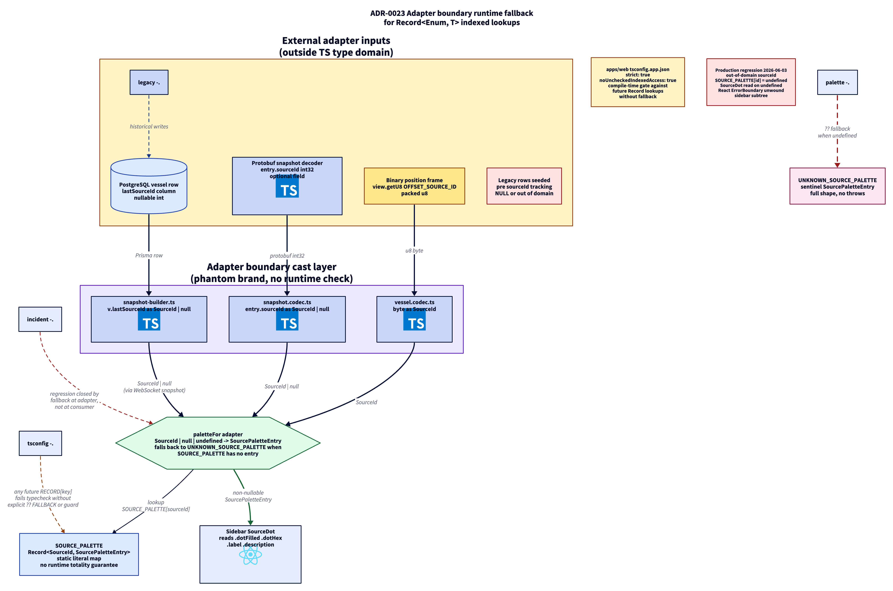

# ADR 0023 - Adapter boundary runtime fallback and tsconfig hardening for indexed lookups

**Status:** Accepted
**Date:** 2026-06-04
**Supersedes:** none
**Related:** ADR-0006 (branded types and data integrity gate), ADR-0007 (binary WebSocket frame), ADR-0010 (static data over WS), ADR-0013 (branded numeric AIS types)

## Context

The application accepts identifiers and enum-like values from sources outside its own type system: the 40-byte binary position frame (`view.getU8(OFFSET_SOURCE_ID)`), the Protobuf snapshot decoder (`entry.sourceId as SourceId`), legacy database rows seeded before `sourceId` tracking existed, persisted local state, URL parameters, and environment variables. Each of these is an adapter point at which a raw runtime value enters typed code.

TypeScript's structural type system treats `Record<Enum, T>` as total: `SOURCE_PALETTE[sourceId]` is inferred as `T`, never `T | undefined`, regardless of whether the runtime value at `sourceId` corresponds to a key the record actually defines. A cast like `byte as SourceId` does not narrow at runtime; it relabels a `number` whose set membership in `{0, 1, 2, 3}` has not been verified. When the indexed lookup yields `undefined` and a consumer reads a property on it, the React error boundary above unwinds the subtree and the affected surface goes blank.

A regression of exactly this shape removed the sidebar tree from the deployed UI: a vessel arrived with a `sourceId` outside the defined enum domain, `SOURCE_PALETTE[sourceId]` returned `undefined`, and the rendering component crashed on `.dotFilled`. The bug was not visible at compile time because the index expression carries the brand type `SourceId`, which TypeScript trusted as a closed set; the brand is a phantom and provides no runtime guarantee.

## Decisions

### D-23-1: Adapter boundary owns the fallback, not the consumer

Every `Record<Enum, T> | Record<Literal, T>` whose index can originate from outside the type system is fronted by an adapter function with explicit fallback semantics. The adapter accepts `Enum | null | undefined`, returns a non-nullable `T`, and falls back to a sentinel entry when the index has no corresponding record key:

```ts
export function paletteFor(sourceId: SourceId | null | undefined): SourcePaletteEntry {
  if (sourceId === null || sourceId === undefined) return UNKNOWN_SOURCE_PALETTE;
  return SOURCE_PALETTE[sourceId] ?? UNKNOWN_SOURCE_PALETTE;
}
```

The sentinel exposes the same shape as the regular entries, so consumers stay declarative. The contract holds for legacy rows, future enum expansions, and decoder edge cases without any per-consumer guard.

### D-23-2: All app tsconfigs enable `strict` and `noUncheckedIndexedAccess`

Every application package in the workspace has both flags set:

```jsonc
{
  "compilerOptions": {
    "strict": true,
    "noUncheckedIndexedAccess": true,
  },
}
```

With the second flag active, `RECORD[runtimeKey]` is typed `T | undefined` regardless of the index brand. Any consumer that wants to use the result has to narrow with `??`, an `if`, or a type guard. This converts the bug class from "compiles, runs, crashes" to "does not compile". Pre-existing code that relied on the looser typing was migrated in the same change; new code inherits the discipline by default.

Apps already on this baseline before this change: `packages/shared`, `apps/edge-bridge`. Apps brought to the baseline by this change: `apps/web`. `apps/api` is next in line and tracked separately.

### D-23-3: Brand types are phantom and do not validate

A cast like `byte as SourceId`, `decoded as Mmsi`, or `protobuf.shipType as ShipTypeCode` is a compile-time label and nothing more. The brand carries no runtime invariant; the cast is the project's convention for "this value came from a parser or validator", not a proof of membership in the brand's domain.

Two consequences follow:

1. **Brand-typed values that flow into a `Record<Brand, T>` indexed access must still pass through an adapter or guard.** The pre-existing branded `SourceId` did not protect `SOURCE_PALETTE[sourceId]`; the adapter does.
2. **Brand-typed values that flow into object-key access (`map[mmsi]`, `staticData[mmsi]`) are naturally safe** because object property reads always return `T | undefined` once `noUncheckedIndexedAccess` is on. No adapter is required for these consumers.

### D-23-4: Pure-function categorisers are an acceptable substitute for adapters

When the dispatch from a brand-typed value to a closed enum is itself a total function (every input maps to a defined enum member, with an explicit default branch), no separate adapter is needed downstream. `shipTypeCategory(code: number): ShipTypeCategory` returns `'other'` for any unrecognised code and feeds `VESSEL_CATEGORY_PALETTE[category]` whose key domain is the closed `ShipTypeCategory` union. The categoriser is the adapter; the palette lookup is total by construction.

## Consequences

- One source of truth per adapter: the fallback is defined once and applies everywhere the indexed access is used. Consumers stop carrying their own defensive code.
- Compile-time prevention for the bug class across `apps/web`. New `Record` lookups against external input cannot land without an explicit fallback.
- Test surface grows by one regression file per adapter, asserting fallback behaviour for null, undefined, and out-of-range integers. The cost is small; the asserted contract is the one that was missing in production.
- One pre-existing app (`apps/api`) still needs the tsconfig flag flipped. It is scheduled as a separate change because the migration is non-trivial (an indexed-access sweep is required first) and outside the scope of the web-side fix.
- The fix does not require schema changes, wire-format changes, or persistence migrations. The adapter sits entirely on the rendering side; the database and the binary frame keep their current shape.

## Verification

- `apps/web/src/modules/map/styles/__tests__/source-palette.test.ts` covers every declared `SourceId`, `null`, `undefined`, and an out-of-range integer cast (`99 as unknown as SourceId`). The out-of-range case is the regression guard for the production incident.
- `pnpm --filter @sps/web typecheck` succeeds with `noUncheckedIndexedAccess` enabled; the only adjustments required were non-null assertions in test code where the test setup guarantees presence of the indexed entry.
- The full `apps/web` Vitest suite passes on the hardened config.
- Manual reproduction: the regression test instantiates the failing path (`paletteFor(99 as unknown as SourceId)`) and asserts the fallback entry shape (`dotFilled`, `dotHex`, `label`, `description`) is fully populated.

## What this does not address

- `apps/api` and `apps/ingest` tsconfig hardening. Tracked separately; each requires its own indexed-access sweep before the flag can be enabled.
- Runtime validators that would actually prove brand membership (e.g. `parseSourceId` that rejects out-of-domain integers at the decoder rather than the renderer). The decoder remains pragmatic per ADR-0013; the adapter compensates downstream.
- Indexed access against literal-union records where the index originates from a typed atom or pure local function. These are total by construction and require no adapter.

## Diagram



> Source: [`0023-adapter-boundary-runtime-fallback.d2`](./0023-adapter-boundary-runtime-fallback.d2). Re-render with `d2 adr/0023-adapter-boundary-runtime-fallback.d2 adr/0023-adapter-boundary-runtime-fallback.png --theme=8 --pad=20`.
