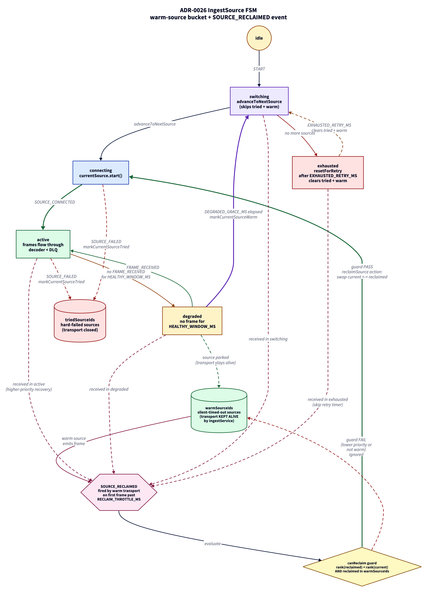

# ADR 0026 - IngestSource FSM: warm-source bucket and reclaim event for non-thrashing failback

**Status:** Accepted
**Date:** 2026-06-04
**Supersedes:** none
**Related:** ADR-0008 (pluggable source architecture), ADR-0013 (branded numeric AIS types), ADR-0019 (edge bridge trust zones)

## Context

The ingest pipeline runs a priority-ordered list of AIS sources (EdgeBridge over mTLS, LocalUdp, WebSdr, AisStream). The IngestSource FSM picks the highest-priority source, watches for frames, and falls back when the current source goes silent or hard-fails. Until this ADR, the FSM treated both failure modes the same: any demotion moved the source to a `triedSourceIds` list and the IngestService closed the underlying transport. The next attempt to use that source had to wait for the `exhausted` retry cycle (60 s) and only fired when _every_ lower-priority source was also tried, which in normal operation never happens because at least one fallback always works.

The practical effect: once the owned RTL-SDR antenna (EdgeBridge) went silent for the healthy window plus the degraded grace period (15 minutes total), the FSM switched to a fallback and never returned to EdgeBridge for the lifetime of the process, even after the Pi came back online. Operators had to restart the API container to re-promote the owned source.

## Decisions

### D-26-1: Distinguish soft demote (silent timeout) from hard fail (error)

A source that times out of its healthy window has not necessarily broken; it might just be momentarily quiet (no AIS broadcasts in range, port temporarily empty). A source that errors (transport failure, auth rejection, malformed handshake) has actually broken. The FSM now tracks these in two separate lists:

- `triedSourceIds`: hard errors. The transport is closed and the source cannot be re-promoted until the exhausted retry cycle clears the list.
- `warmSourceIds`: silent timeouts. The transport stays alive (the IngestService keeps the subscription open) and the source is reclaimable via a `SOURCE_RECLAIMED` event.

### D-26-2: New event `SOURCE_RECLAIMED` with priority guard

When a warm source produces a frame after demotion, the IngestService fires `SOURCE_RECLAIMED { sourceId, frameAt }`. The FSM guard `canReclaim` accepts the event only when:

1. The reclaiming source is currently on the warm list, AND
2. Its rank in `prioritizedSourceIds` is strictly lower (= higher priority) than the rank of the currently active source.

If both conditions hold, the FSM transitions to `connecting`, swaps the reclaimed source into the active slot, and moves the previously active source to the warm list so its transport remains available for a future reverse swap.

This guard is the anti-thrashing rule: a lower-priority warm source cannot pre-empt a higher-priority active source. Without it, two equally-flaky fallbacks could flip the active source back and forth on every spurious frame.

### D-26-3: IngestService projects FSM state to transport role

The IngestService no longer reasons about lifecycle in terms of a single "active source" with start/stop on every transition. It projects `(currentSourceId, warmSourceIds)` from the FSM snapshot to a transport role per registered source:

- **active**: subscribed; frames flow through the decoder and DLQ.
- **warm**: subscribed; frames trigger throttled `SOURCE_RECLAIMED` only.
- **tried/idle**: not subscribed; transport closed.

Role transitions in either direction (active <-> warm) keep the underlying transport open, eliminating the reconnect window when a recovered source slides back into the active slot. `RECLAIM_THROTTLE_MS = 30 s` caps how often a warm source can fire reclaim attempts, so a misbehaving fallback that keeps spamming the FSM cannot burn CPU.

### D-26-4: Exhausted retry clears both lists

When the `exhausted` state's timer fires, the `resetForRetry` action clears both `triedSourceIds` and `warmSourceIds`. A fresh cycle starts from the highest-priority source as if from boot. This preserves the existing "every source has rotted, kick everything over" recovery path; warm sources are not exempt from the periodic reset.

## Consequences

- The owned RTL-SDR signal path can recover without operator intervention. When the Pi reconnects and starts streaming again, the active source switches back to EdgeBridge on the first frame past the throttle window.
- Transport churn drops. A demote-then-recover cycle no longer pays for a TCP close and a fresh TLS handshake; the warm subscription stays put.
- `IngestContext` grows by one field (`warmSourceIds`). Existing FSM tests that asserted "after grace period, source goes to tried" needed a single update to assert "warm" instead. Six new FSM tests cover the reclaim paths.
- The IngestService has a richer state machine of its own (per-source role) that mirrors the FSM context. The reconciliation logic is idempotent so duplicate FSM emissions are safe.
- A misbehaving warm source could fire reclaim attempts at the throttle ceiling (one every 30 s) indefinitely if its priority is higher than the active source AND it never actually stays healthy. The `canReclaim` guard accepts each one, but downstream the source immediately degrades again. The cost is bounded - one FSM transition every 30 s plus a 15-minute healthy-then-degraded cycle - so this case is bounded, not pathological.

## Verification

- Six new tests in `packages/shared/src/machines/__tests__/ingest-source-machine.test.ts` cover: warm-source bookkeeping on soft demote, reclaim swap with displaced-current parked warm, non-warm source reclaim ignored, anti-thrashing rank check, reclaim recovers from exhausted without waiting for retry, exhausted-retry clears both lists.
- The existing test "after grace period in degraded switches to next priority" updated to assert the source lands in `warmSourceIds` (not `triedSourceIds`).
- `apps/api` test suite (142 tests) unchanged - the IngestService refactor is contained within `reconcileSources` and the new `attachWarmSource` / `detachAllWarmSources` methods. The active path through `attachSource` and the decoder remain untouched.
- All web tests (177) and edge-bridge typecheck pass; shared library bumped to new context shape.

## What this does not address

- Multi-warm hot-swap orchestration. The current model assumes at most one source is mid-promotion at a time. A second `SOURCE_RECLAIMED` arriving during the connecting state is handled by re-entering connecting; orchestration of two concurrent promotion attempts is not modelled.
- Backpressure between warm sources and the FSM event queue. Each warm transport is bounded by `RECLAIM_THROTTLE_MS` but the system relies on XState's synchronous event delivery to absorb bursts.
- Telemetry signal exposing warm-source state to the operator. The FSM context is available via `actor.getSnapshot()` for future metrics; no UI surface added in this change.

## Diagram

> Source: [`0026-fsm-warm-source-reclaim.d2`](./0026-fsm-warm-source-reclaim.d2). Re-render with `d2 adr/0026-fsm-warm-source-reclaim.d2 adr/0026-fsm-warm-source-reclaim.png --theme=8 --pad=20`.
