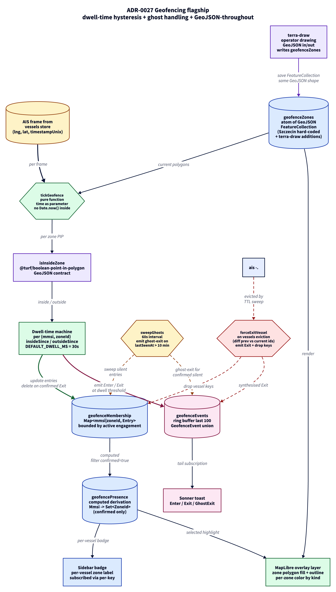

# ADR 0027 - Geofencing flagship: dwell-time hysteresis, ghost-vessel handling, GeoJSON-throughout

**Status:** Accepted
**Date:** 2026-06-04
**Supersedes:** none
**Related:** ADR-0006 (data integrity gate), ADR-0011 (dead reckoning), ADR-0021 (sidebar throttle), ADR-0022 (vessel layer rAF)

## Context

The D10 sprint plan calls for "smart port" geofencing - operator-defined polygon zones (port channel, anchorages, restricted areas) plus vessel entry/exit detection surfaced on the map, in the sidebar, and through toasts. The naive implementation - on every vessel position, check inside/outside for each zone and fire an event on transition - looks straightforward but breaks under three real-world conditions:

1. **GPS noise** (10-50 m on AIS positions in cluttered urban RF) flips a vessel sitting near a zone boundary back and forth dozens of times per minute. Naive transition detection produces a thrashing stream of Enter/Exit events.
2. **Ghost vessels**: a vessel inside a zone whose transponder goes silent (failure, intentional disabling, line-of-sight loss) never produces an Outside frame. The naive machine considers it confirmed-inside forever.
3. **Memory growth**: tracking per-(mmsi, zoneId) state in a map without cleanup means transient vessels (cargo passing through Szczecin once) leave permanent footprints in memory across an uptime measured in days.

A second tier of architectural questions:

- Where to keep the state - singleton service, server-side detection, or reactive store?
- What polygon representation - own format or GeoJSON?
- How to handle the operator-drawn zones path that is in the roadmap?

## Decisions

### D-27-1: Reactive derived store, not singleton service or server-side detection

The dwell-time membership state lives in a Nano Stores atom (`$geofenceMembership`); operator-visible projection (`$geofencePresence`) is a `computed` derivation. The reactive pipeline subscribes to `$vessels` and feeds the dwell-time machine on each frame. This fits the project's existing pattern (`$vessels`, `$vesselStaticData`, `$selectedMmsi`) and supports per-key subscription so the sidebar badge for one vessel re-renders without churning every other row.

Server-side detection (api computes events, pushes via WebSocket) was rejected because the WS round-trip injects 50-150 ms of latency between visual boundary crossing and event surface - on a real-time radar UI that desynchronisation is operator-visible. Singleton service was rejected because it does not compose with the existing per-key subscription model.

### D-27-2: GeoJSON FeatureCollection as the canonical zone format

Zones are GeoJSON `Feature<Polygon, ZoneProperties>` from end to end - hard-coded Szczecin set, operator-drawn additions, persistence layer (future). `terra-draw` (the drawing tool) emits GeoJSON natively, `@turf/boolean-point-in-polygon` consumes it natively, and the persistence story (load from a config file or future REST endpoint) needs no adapter. One format, no transforms.

### D-27-3: Dwell-time hysteresis (30 s) for boundary flicker

Enter and Exit each require the vessel to be on one side of the boundary continuously for `DEFAULT_DWELL_MS = 30 s` before firing. Implementation: per-(mmsi, zoneId) state tracks `insideSince` and `outsideSince` timestamps; an event fires only when the elapsed run exceeds the threshold. A vessel oscillating on the boundary never accumulates 30 s of continuous presence on either side, so produces zero events.

Threshold picked larger than the AIS Class A broadcast interval (2-10 s for an underway vessel) so a single noisy fix cannot trigger a phantom Enter. Tuneable via the `DwellConfig` parameter on `tickGeofence`.

### D-27-4: Time as data, not Date.now

Every dwell calculation takes `now` as an explicit parameter. In production this is sourced from `frame.timestampUnix` converted to milliseconds; in tests it is injected directly. The dwell machine never calls `Date.now()` internally.

Three correctness properties follow:

- **Replay determinism**: replaying the same frame sequence produces identical events, regardless of wall-clock time at replay.
- **Backlog tolerance**: a WebSocket message backlog that delivers frames out of wall-clock order does not produce ghost transitions; time flows with the data.
- **Tab-throttling immunity**: a browser tab in the background does not produce phantom event timing because the dwell clock is driven by frame timestamps, not by `setTimeout` callbacks.

### D-27-5: Two-mechanism ghost-vessel handling

A confirmed-inside vessel that goes silent must not stay parked in a zone indefinitely. The system uses two redundant mechanisms:

- **Vessel eviction signal**: the pipeline diffs `$vessels` snapshots on every change; vessels that disappeared from the store (because the TTL sweeper deleted them) trigger `forceExitVessel`, which fires Exit for every confirmed zone and drops all of the vessel's keys from the membership state.
- **Independent watchdog**: a 60 s interval calls `sweepGhosts` with `now = Date.now()`. Any entry whose `lastSeenAt` is older than `DEFAULT_GHOST_TIMEOUT_MS = 10 min` is swept; confirmed entries emit a `ghost-exit` event, unconfirmed entries are dropped silently.

Both mechanisms are needed: the eviction signal triggers immediately when the TTL sweeper runs, but the watchdog catches edge cases where the eviction sweep itself is delayed.

### D-27-6: Memory-bound by construction

The membership state is a flat `Map<MembershipKey, MembershipEntry>` with two cleanup paths:

- A confirmed Exit deletes the (mmsi, zoneId) key entirely.
- An unconfirmed entry whose vessel drifts away (outside dwell window elapses without a confirmed Enter) is also deleted.
- Vessel eviction deletes every key for that vessel.
- Ghost sweep deletes every silent entry.

State size is therefore bounded by `O(active vessels currently engaged with zones)`, never by the cumulative count of vessels ever seen.

## Consequences

- The geofencing module is testable as pure logic: 16 dwell-machine tests in `packages/shared/src/geofencing/__tests__/dwell-machine.test.ts` cover hysteresis, ghost-vessel scenarios, replay determinism, memory bounds, and multi-zone independence. 6 pipeline tests in `apps/web/src/modules/geofencing/state/__tests__/` cover the live `$vessels` integration.
- Bundle cost: `@turf/boolean-point-in-polygon` + `@turf/helpers` add ~5 KB gzip to the `vendor-state` chunk. `terra-draw` + adapter lands later (Session 2) as an async chunk attached to the lazy `<MapView>`.
- The Szczecin zone set is hard-coded for demo purposes (5 polygons traced over OSM port outline). Operator-drawn zones (Session 2 via `terra-draw`) write into the same atom; no code change is needed to switch between hard-coded and drawn.
- Performance: PIP on Szczecin's ~5 polygons of ~5 vertices each costs ~25 ray-cast comparisons per vessel update. Total work across 67 vessels at 2 Hz is ~3,400 ops/sec - negligible. The reactive pipeline path is bounded by the same.

## Verification

- `pnpm --filter @sps/shared test`: 247 tests pass (231 pre-existing + 16 new geofencing).
- `pnpm --filter @sps/web test`: 183 tests pass (177 pre-existing + 6 new pipeline integration).
- `pnpm --filter @sps/web typecheck` + lint clean.
- Manual scenarios covered by tests: vessel oscillating 60 s on boundary produces zero events; sustained 30 s inside emits exactly one Enter; vessel eviction from `$vessels` fires synthetic Exit; ghost watchdog emits `ghost-exit` after 10 min silence; 1000-transient-vessel churn leaves zero residual state after the ghost window elapses.

## Session 2 surface (UI layer)

The second commit on this branch consumes the Session 1 contract above and adds the operator-facing surface:

- `ZoneLayer` mounts a GeoJSON source seeded from `$geofenceZones` plus three MapLibre layers (fill, outline, label) ordered for correct paint depth. A subscription to `$geofenceZones` calls `source.setData` on every operator drawing save - same code path serves the hard-coded Szczecin set and live drawings without branching.
- `GeofenceToaster` mounts the sonner Toaster portal and subscribes to `$geofenceEvents`. New events surface as `toast.info` (Enter), plain toast (Exit), or `toast.warning` (ghost-exit), keyed for deduplication so React Strict Mode double-render in dev never produces phantom duplicates.
- `ZoneBadges` mounts inside the sidebar list item and reads `$geofencePresence` via `useStore($geofencePresence, { keys: [String(mmsi)] })`. The per-key subscription is exactly the L6 budget the Session 1 store shape bought - only the rows whose vessels actually flipped zone membership re-render.
- `ZoneDrawToolbar` is a single header button that dynamically imports terra-draw + the MapLibre adapter on first click (chunked at ~42 KB gzip + ~3 KB adapter, kept off the initial bundle). Operator clicks vertices, double-click finishes; the resulting GeoJSON polygon folds into `$geofenceZones` with an auto-generated id + "Custom Zone N" label. terra-draw's `setGeofenceZones` validator rejects ids containing `|` so the membership map composite key parser cannot be confused by future input.
- `useGeofencePipeline` mounts `startGeofencePipeline` at the index route; tear-down on unmount keeps Strict-Mode double-mount safe.

## What this does not address

- Persistence of operator-drawn zones beyond a page reload. Drawn zones live in memory; a future ADR will cover the server-side persistence model.
- Zone properties editor (rename, change kind, recolor). Drawn zones get auto-id + "Custom Zone N" label + the generic kind; a properties panel is a follow-up task.
- Per-zone alerting rules ("notify only on Restricted Zone entries"). Today every zone fires the same Enter/Exit event surface; selective alerting is a follow-up.
- Multi-mode drawing (rectangle, circle, line). terra-draw supports them but a single-button polygon flow is enough for MVP; widening to a ribbon happens when the second shape genuinely lands.

## Diagram

> Source: [`0027-geofencing-flagship.d2`](./0027-geofencing-flagship.d2). Re-render with `d2 adr/0027-geofencing-flagship.d2 adr/0027-geofencing-flagship.png --theme=8 --pad=20`.
