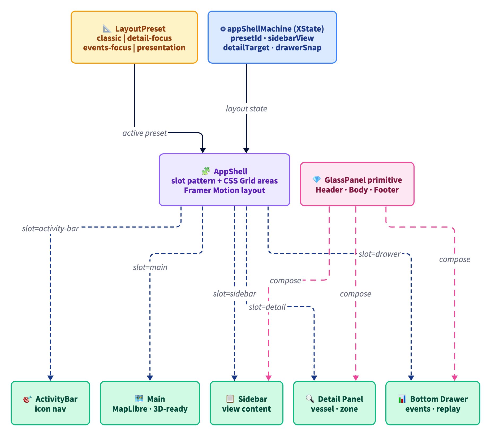

# ADR 0028 - App Shell slot architecture with layout presets and XState-owned state

**Status:** Accepted
**Date:** 2026-06-04
**Supersedes:** none
**Related:** ADR-0006 (data integrity), ADR-0017 (map engine refactor), ADR-0027 (geofencing flagship)

## Context

The operator surface is growing: vessel list, status pill, map controls, and a queued list of new surfaces (zone drawing toolbar, vessel detail panel, geofence event log, future replay scrubber). The original AppShell exposed two compounds (`Header`, `Main`) wired by composition order into a vertical flexbox. Adding a sidebar required rewriting every consumer; adding a detail panel that slides in on selection required either threading state through props or scattering positioning logic across feature modules.

Three concrete problems:

1. **Position-in-tree equals layout.** Moving the sidebar from left to right meant rewriting `<AppShell>` JSX in every route. There was no separation between _what_ is rendered and _where_.
2. **No machine-checkable layout state.** Which slots are visible, which view the sidebar shows, whether the detail panel is open - all of this lived as ad-hoc `useState` per feature, with no audit trail of transitions.
3. **3D readiness.** The next map phase will run a WebGL/3D layer; an opaque header strip and solid sidebar break the visual depth the 3D surface needs. The shell needs translucent surfaces by default and a `presentation` mode that auto-hides chrome.

A second tier of architectural questions:

- How to keep the shell extensible (new surfaces land without rewriting old code)?
- How to make layout reconfigurable (swap classic vs presentation vs events-focused) without per-component branches?
- How to avoid library lock-in for a pattern this central to the app?

## Decisions

### D-28-1: Named-slot compound, content addressed by `name` prop

Consumers declare what goes where with `<AppShell.Slot name="...">`, not by composition order. The shell collects children by inspecting `displayName === 'AppShell.Slot'` and indexing by `name`. Each slot maps to a CSS Grid `grid-area`, so position is data, not structure.

```tsx
<AppShell>
  <AppShell.Slot name="header">
    <Header />
  </AppShell.Slot>
  <AppShell.Slot name="sidebar">
    <Sidebar />
  </AppShell.Slot>
  <AppShell.Slot name="detail">
    <DetailPanel />
  </AppShell.Slot>
</AppShell>
```

Moving the sidebar from left to right is a one-line change to the preset's `gridTemplateAreas`, with zero consumer churn.

A registry-based alternative (slots register themselves through Context) was rejected as overkill: it solves cross-tree slot registration we do not need, and pays a hooks/context cost every render.

### D-28-2: Layout presets as data; CSS Grid template areas drive position

Four named presets ship today: `classic`, `detail-focus`, `events-focus`, `presentation`. Each is a plain object with `gridTemplateAreas`, `gridTemplateColumns`, `gridTemplateRows`, and a per-slot `visible` map. Swapping presets is a single state transition; the shell re-renders the same slots in new positions.

The presets are typed with `as const satisfies Record<string, LayoutPreset>` so adding a preset is exhaustive-checked, and `PresetId` is derived from the literal keys.

### D-28-3: XState owns layout state

`appShellMachine` carries five context fields: `presetId`, `sidebarView`, `sidebarCollapsed`, `detailTarget`, `drawerSnap`. Six event types cover every state change. Cross-cutting transitions (open detail panel - auto-swap from `classic` to `detail-focus`) live in machine actions, not in components.

Three properties follow:

- **Auditable.** Every transition is named and testable. Ten transition tests in `apps/web/src/shell/__tests__/app-shell.machine.test.ts` cover the matrix.
- **Decoupled.** A toast can open the detail panel without knowing the panel exists - it just sends `{ type: 'detail.open', target }`. The machine handles preset side effects.
- **Reactive at one spot.** The shell subscribes to the machine via context; layout reads are O(1) and components needing layout state pull through `useAppShell()`.

### D-28-4: GlassPanel as the canonical surface primitive

One reusable compound (`GlassPanel` with `Header`, `Title`, `Actions`, `Body`, `Footer`) supplies the visual chrome for every panel-shaped slot. Surface tone (background opacity, border weight) is a `tone` prop. Tints adapt to light/dark via existing CSS variables.

Sidebar, detail panel, and drawer are thin wrappers (~30 LOC each) that compose `GlassPanel` with their own positioning/motion. Activity bar stays separate - icon nav is not panel-shaped.

### D-28-5: Framer Motion for slot transitions

Slot mount/unmount and layout reflows use Framer Motion's `layout` + `AnimatePresence`. Spring physics (`stiffness: 220, damping: 26`) give a weighty, operator-grade feel that does not slow operators down. Animations are opacity + transform only (no width/height) for hardware-accelerated paths.

Framer Motion was preferred over CSS transitions because preset swaps move slots between grid cells, and CSS cannot animate `grid-area` changes directly; FLIP via Framer Motion gives the morph for free.

## Consequences

- One source of truth for layout: change a preset, the whole app reflows; change a slot's grid area, all routes follow.
- Future surfaces (replay scrubber, alert dashboard, multi-select bar) add by registering a new slot name and updating presets - no AppShell rewrite.
- The XState machine catches contradictory states at compile time (event union must be handled) and runtime (transition tests).
- Bundle cost: Framer Motion adds ~50 KB gzip, `@radix-ui/react-tabs` ~8 KB gzip. Offset partly by future use across activity bar a11y, drawer drag gestures, and modern card morph animations.
- 3D mode is one preset away (`presentation` already hides all chrome).
- Migration is feature-parity for PR #1: existing layout unchanged, only the underlying mechanism rewritten.

## Verification

- `pnpm --filter @sps/web test`: 187 tests pass (177 pre-existing + 10 new shell tests).
- `pnpm --filter @sps/web typecheck` + lint clean.
- Manual verification: classic preset matches the previous layout pixel-for-pixel; switching to `presentation` programmatically reveals map-only mode; `detail.open` event triggers preset swap and slot reflow without re-rendering the sidebar tree.

## What this does not address

- Persistence of operator preferences (which preset is default, sidebar view, drawer snap). A follow-up will write the machine snapshot to localStorage on transition and hydrate on startup.
- Keyboard shortcut wiring beyond mounting points. A follow-up will register `⌘B` for sidebar toggle, `Esc` for detail close, `⌘1-4` for preset swap.
- Mobile breakpoint handling. The current presets target desktop; a `mobile` preset with bottom-drawer-primary layout lands when the responsive pass starts.

## Diagram



> Source: [`0028-app-shell-slot-architecture.d2`](./0028-app-shell-slot-architecture.d2). Re-render with `d2 adr/0028-app-shell-slot-architecture.d2 adr/0028-app-shell-slot-architecture.png --theme=8 --pad=20`.
