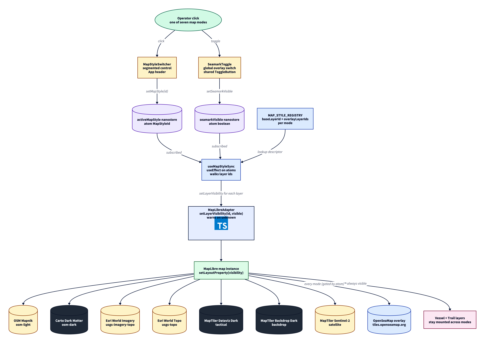

# ADR 0030 - Map style engine with seven operator-facing modes

- Status: accepted
- Date: 2026-05-13 (initial), refined 2026-05-24 via #156

## Context

The map shipped with a single OSM raster style. AIS vessels rendered cleanly but the visual register stayed the same regardless of the operator task: a port watchstander auditing channel approaches, an analyst correlating positions with the actual quay, and someone scanning open water for stragglers all read the same beige base. Three different jobs, one visual answer.

Adding a single seamark overlay toggle solves one of the three. A pluralistic style engine with multiple base modes solves all three and signals "purpose-built tool" rather than "tutorial map".

## Decision

Adopt a map style engine with seven modes, each a fixed combination of one base raster layer and one optional seamark overlay layer.

| Mode id             | Label               | Base tile source                                |
| ------------------- | ------------------- | ----------------------------------------------- |
| `osm-light`         | OSM Light           | OpenStreetMap Mapnik (`tile.openstreetmap.org`) |
| `osm-dark`          | OSM Dark            | Carto Dark Matter (`basemaps.cartocdn.com`)     |
| `usgs-imagery-topo` | USGS Imagery + Topo | Esri World Imagery (`server.arcgisonline.com`)  |
| `usgs-topo`         | USGS Topo           | Esri World Topo (`server.arcgisonline.com`)     |
| `tactical`          | Tactical            | MapTiler Dataviz Dark                           |
| `backdrop`          | Backdrop            | MapTiler Backdrop Dark                          |
| `satellite`         | Satellite           | MapTiler Sentinel-2                             |

Every mode shares the same OpenSeaMap seamark overlay, rendered at `raster-opacity: 0.7` with `minzoom: 9` so symbols read as context rather than dominating at country / region zoom. The operator toggles the overlay globally via the seamark switch.

A single MapLibre style spec holds all base raster sources plus the seamark overlay plus the existing vector vessel and trail layers. A nanostore atom (`$activeMapStyle`) names the active style id; a sync hook (`useMapStyleSync`) subscribes to the atom plus the seamark visibility atom and walks `ALL_BASE_LAYER_IDS` plus `ALL_OVERLAY_LAYER_IDS` on every change, flipping `layout.visibility` through the engine adapter. The vessel and trail layers stay mounted across mode changes; only the base raster visibility flips.

## Tradeoffs considered

### Rebuild the style on each mode change

Pros: each style is a self-contained spec, no shared layer ids to keep aligned. Cons: MapLibre re-initialises on every `setStyle` call, vessels disappear for a frame, the scroll position resets unless explicitly restored. The whole point of the engine is smooth task switching; rebuild defeats it.

### Single style with visibility toggles (chosen)

Pros: zero map re-init across switches, vessel layers continuous, inactive base tiles do not fetch (MapLibre gates tile loading by layer visibility). Cons: style spec is heavier on initial load (seven raster sources declared vs one), irrelevant at the bytes we ship and the network roundtrips we already pay for vessels.

### Per-mode separate React components

Pros: complete UI isolation. Cons: any state that crosses modes (selection, trails predicate, sidebar context) becomes prop-drilled. The map engine is one map; rendering it seven times is over-engineering.

## Tile sources

Four sources are free and key-free; three are MapTiler maps that read the `VITE_MAPTILER_KEY` inlined at build time. MapTiler enforces an origin allowlist on the key so the public inlined key is only useful from approved origins.

- OSM Standard via `tile.openstreetmap.org`, attribution required.
- Carto Dark Matter via `*.basemaps.cartocdn.com`, attribution required, free for fair use.
- Esri World Imagery and Esri World Topo via `server.arcgisonline.com`, attribution required, free for non-commercial use.
- MapTiler Dataviz Dark, Backdrop Dark and Sentinel-2 satellite via `api.maptiler.com`, attribution required, origin-locked key.
- OpenSeaMap seamarks via `tiles.openseamap.org`, attribution required.

A GEBCO bathymetry overlay was prototyped but cut: the GEBCO public WMS does not advertise CORS headers for browser fetches, every tile request fails with HTTP 0, and the MapLibre error listener pushes the map state machine into `error` which suppresses the vessel layer. A future iteration can re-introduce bathymetry through a CORS-friendly source or by proxying GEBCO through our own api.

If any single active source goes down the map degrades gracefully: the affected layer becomes blank, the rest of the style continues to render. No single point of failure takes the demo down.

## Consequences

- `vercel.json` Content-Security-Policy `img-src` directive allowlists every base tile origin (Carto, Esri, MapTiler) plus OpenSeaMap for the overlay.
- A new mode is a one-file change: add a new `MapStyleId`, declare base source and layer in `osm-raster-style.ts`, register the descriptor in `MAP_STYLE_REGISTRY`. The switcher UI auto-renders the new entry.
- Layer ordering is load-bearing: base layers precede overlays which precede vessel and trail vector layers. A future contributor moving layer declarations around can break the visual order; the exported layer-id symbols (`BASE_*_LAYER_ID`, `SEAMARK_OVERLAY_LAYER_ID`) stay constant so the sync hook continues working regardless.
- `IMapEngineAdapter` exposes `setLayerVisibility(layerId, visible)`. The MapLibre implementation logs a `console.warn` if the layer is not present in the current style and returns without throwing, so adapter swapping (a future engine that does not declare every overlay) fails soft and surfaces the mismatch in dev / preview without taking the map offline in production.

## Refinements (#156)

A quality follow-up landed via PR #157, behaviour-preserving:

- Every shared layer id is exported as a single symbol from `osm-raster-style.ts` and imported across descriptors, the sync hook and the seamark-visibility doc, replacing string literal duplication.
- `ALL_OVERLAY_LAYER_IDS` derived from `MAP_STYLE_REGISTRY` so a future overlay needs no second edit.
- `ensureVesselIcons` made idempotent (early return when every icon id is registered), pre-builds every `ImageData` upfront inside one try/catch so a canvas-context loss falls back to circles for every category instead of partial-failure mix, and passes `pixelRatio: window.devicePixelRatio` for SDF icons so silhouettes render at native DPI on HiDPI displays.
- `makeBaseRasterLayer(id, source, visibility)` factory replaces seven identical raster layer literals.
- `buildCategoryColorMatchExpression` helper replaces two `as unknown as ExpressionSpecification` double casts with a single documented boundary cast.
- `<ToggleButton>` primitive factors `seamark-toggle` and `trails-toggle` (1:1 structural duplicates) into one parametrised component with `cva` accent variants.

## Flow

See `0030-map-style-engine.d2` for the data flow from switcher click through the nanostore atom and sync hook to the engine adapter and MapLibre tile sources.

> Render with: `d2 adr/0030-map-style-engine.d2 adr/0030-map-style-engine.png --theme=8 --pad=40`.
